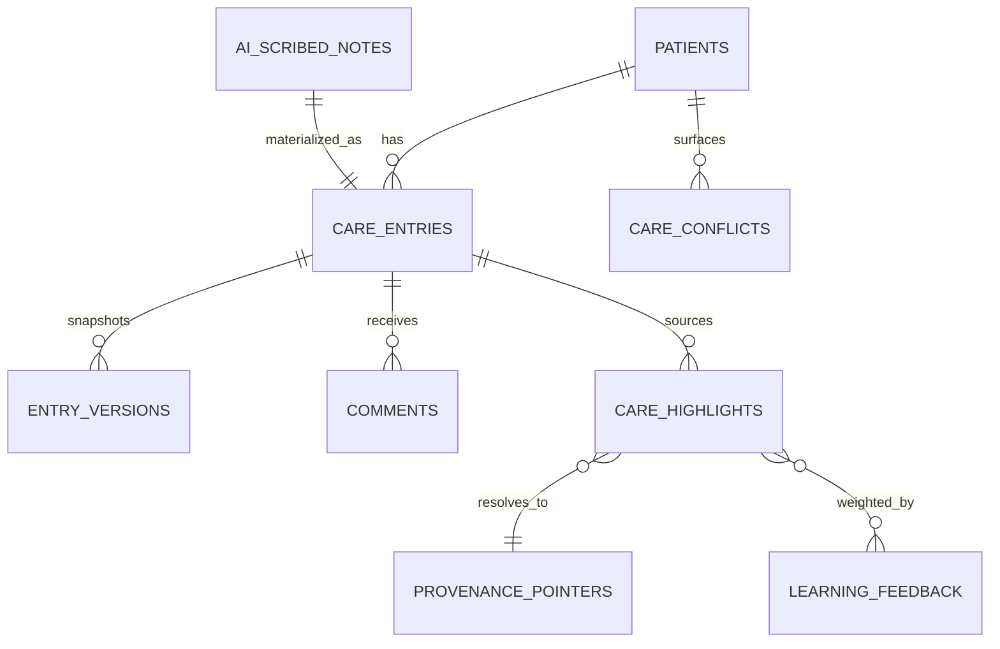

# Nightingale Care Note Technical Brief

Root directory: `C:\Users\liuru\Downloads\Nightingale-Care-Note (1)`

## 1. Overview

Nightingale Care Note is a provenance-first clinical workspace for one longitudinal patient story shared across four domains: `Patient`, `Staff`, `Clinician`, and `Admin`.

The central design principle is simple: an AI-derived badge, score, or summary should not exist only because it can be rendered. Every surfaced item should answer:

- What is it?
- How would we know if it were wrong?
- What happens if it is wrong?

That principle drives three system requirements:

- role-scoped visibility and editing
- provenance-backed highlights and summaries
- deterministic safety floors for risk, confidence interpretation, and patient release

## 2. Architecture

```mermaid
flowchart TD
    U[User by Domain] --> UI[Web App\napp/page.tsx]
    UI --> API[/Workspace API\napp/api/workspace/route.ts/]
    API --> MODEL[Shared Model\nlib/workspace-data.ts]

    UI --> SVC[CareNoteService\nbackend/app/service.py]
    SVC --> RULES[RBAC + Provenance + Redaction\nRisk Floors + Abstention + Conflicts]
    RULES --> DB[(Drizzle / D1 Schema)]

    SVC --> SCRIBE[/ai/scribe]
    SVC --> TL[/patients/{id}/timeline]
    SVC --> CF[/patients/{id}/conflicts]
```

### Explanation

- The web app handles login-domain selection, role-aware rendering, patient-facing AI labeling, and demo interactions.
- The workspace API returns a role-scoped payload in one consistent shape.
- The shared model keeps entries, profile data, highlights, conflicts, and AI approval state aligned across UI and storage.
- The backend service is the rule engine. It enforces clinic scope, patient scope, role-based authoring, version conflicts, provenance resolution, PHI redaction, conflict detection, and patient-summary approval or abstention.
- The Drizzle schema is already aligned to this model so the app can move from static payloads to real D1-backed storage without changing the product contract.

## 3. Data Model



### Core entities

#### `patients`
- Longitudinal patient profile
- Stores clinic scope and editable medical basics such as height, weight, BMI, blood pressure, pulse, and allergies

#### `care_entries`
- Canonical timeline object
- Covers clinician sections, staff notes, patient instructions, raw AI-scribed notes, and AI-assisted patient summaries
- Important fields:
  - `allowedRoles`
  - `patientVisible`
  - `ai`, `aiMode`
  - `approval`, `approvalBy`
  - `provenance`
  - `extractionMode`
  - `validationTarget`
  - `riskLevel`
  - `confidenceScore`, `confidenceLabel`
  - `importanceScore`
  - `deterministicFloor`
  - `version`

#### `comments`
- One-to-many from `care_entries`
- Internal collaboration only
- Present in the UI model and should become a persistent table next

#### `entry_versions`
- Immutable snapshots per edit
- Required for optimistic locking, exact provenance resolution, and safe revert
- Implemented in backend logic and a good candidate for the next persistent table

#### `care_highlights`
- Derived “what needs attention now” artifacts
- Must point back to a concrete source entry and source version
- Can also represent abstention when patient-facing AI output is withheld

#### `provenance`
- More than display text
- Backend logic stores source entry, source version, exact source span, quoted text, and provenance pointer
- `resolve_provenance()` verifies the highlighted quote against the immutable source

#### `ai_scribed_notes`
- Currently represented as `care_entries` where `ai=true` and `aiMode="raw"`
- This keeps the MVP timeline simple
- A dedicated table may still be useful later for transcript/session retention and stricter controls

#### `care_conflicts`
- Explicit contradiction objects
- Current scope is intentionally narrow:
  - allergy vs medication list
  - medication dosage mismatch
  - unresolved contradictions across staff and clinician notes

### Learning integration

The current learning mechanism is intentionally limited:

- `pin()` increases topic weight
- `score_importance()` consumes that weight

This is not full self-learning. It is a transparent ranking bias layered on top of deterministic safety floors.

## 4. Safety Logic

### Extraction vs generation

The system distinguishes two modes before prompting or release:

- `extractive`: directly grounded in signed clinician, staff, or system content
- `generated`: transformed by AI and therefore requires explicit validation targets

This matters because paraphrases do not preserve truth by default. Generated content must always answer: what source justifies it, and who approved it?

### Risk, confidence, and importance

- Risk is not purely model-assigned. `deterministic_risk_floor()` creates a lower bound from clinically important signals such as allergy, facial swelling, syncope, breathlessness, and chest pain at rest.
- Confidence is numeric and mapped into explicit bands through `normalize_confidence()`. “Medium” therefore has operational meaning.
- Importance combines topic class, risk class, and feedback weight, but critical categories keep a hard floor so fatigue or sparse feedback cannot suppress them below safety thresholds.

### Redaction as accuracy

`analyze_redaction()` treats redaction as a correctness problem, not only a privacy step. It reports:

- replacement counts
- residual findings
- overall safety state

This lets the pipeline fail closed if identifiers remain after preprocessing.

### Conflict detection

`detect_conflicts()` focuses on medication, dosage, and allergy contradictions because they are both common and high impact. This is a deliberate MVP scope choice: catch the classes where deterministic rules give immediate safety value before expanding to broader semantic contradiction.

### Patient-facing generation

Patient-facing output is a higher severity class than internal notes:

- raw AI cannot be shown directly to patients
- unsupported summaries abstain
- generated patient-visible content requires explicit human approval

That is why the UI distinguishes `AI-scribed`, `AI-assisted`, `Approved`, `Needs review`, and `Abstained`.

## 5. Assumptions and Trade-offs

### Assumptions

- Single-clinic synthetic demo
- One patient story is enough to validate longitudinal workflows
- Login-domain selection is a demo control, not production authentication
- Static workspace payloads are acceptable until D1-backed reads are completed

### Trade-offs

#### Unified entry model
- Pro: one timeline model across clinician, staff, patient, and AI artifacts
- Pro: simpler rendering and lower schema sprawl
- Con: some constraints remain code-enforced rather than purely relational

#### Full snapshots instead of diffs
- Pro: easier audit, revert, and provenance verification
- Con: more storage

#### Deterministic rules plus AI
- Pro: safer baseline, easier evaluation, better explainability
- Con: more manual rule maintenance

#### Human approval for patient release
- Pro: strongest protection against hallucinated patient instructions
- Con: extra workflow friction

#### Transparent feedback weights instead of opaque learning
- Pro: interpretable and reversible
- Con: less adaptive than full retraining

## 6. Recommended Next Step

Replace static `buildWorkspace()` reads with real D1-backed queries for:

- `patients`
- `care_entries`
- `care_highlights`
- `care_conflicts`

Then add persistent tables for:

- `entry_versions`
- `comments`
- patient-summary review events

That would complete the move from a provenance-aware demo to a provenance-backed application.
